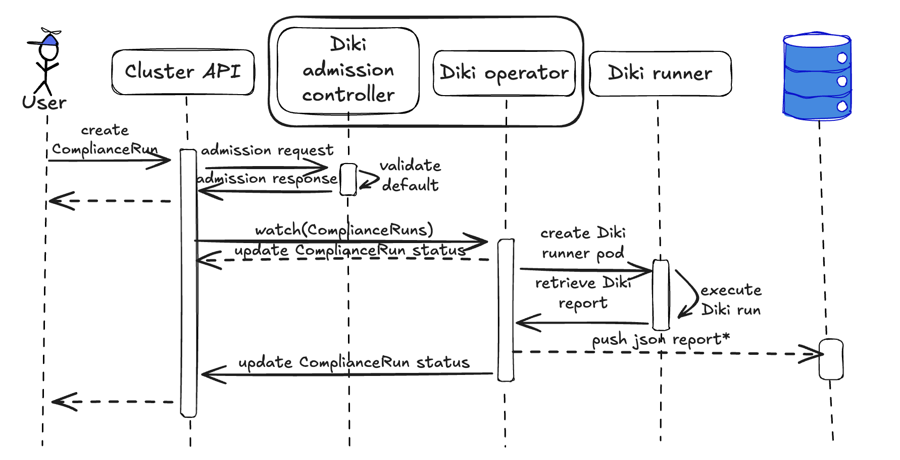
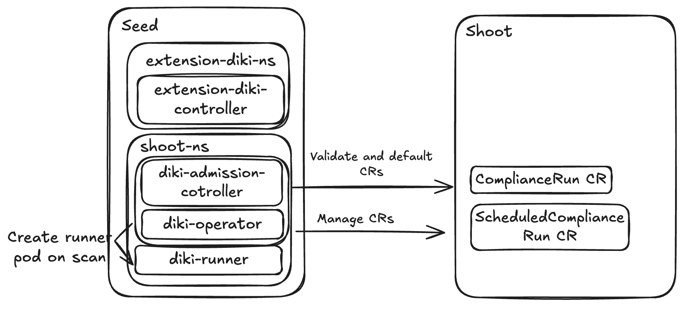

# Diki as a Service Minimal Working Version

## Motivation

Currently, we recommend Gardener users to use the `Diki` CLI for running compliance scans in their `Shoot` clusters.
This leads to users having to manage the execution of `Diki` runs themselves, including scheduling, configuration, report collection and storage.
The current initiative is to provide a `Diki` service within Gardener that will improve the user experience and streamline compliance management.

## Proposal

For a minimal working version, the `Diki` service will focus on the following key features:
- Allow users to run compliance scans on-demand via a custom resource.
- Store summary compliance reports in the status of the new custom resource.
- Allow users to schedule recurring compliance scans via a custom resource.

### API

There will be 2 new Custom Resource Definitions (`CRD`s) deployed in `Shoot` clusters.
They will be cluster-scoped resources.

#### ComplianceRun

``` yaml
apiVersion: diki.gardener.cloud/v1alpha1
kind: ComplianceRun
metadata:
  name: example-compliancerun
spec:
  # available Diki version should be listable by users via API. Open point for future improvement
  dikiVersion: v0.22 # defaults to latest (only minor versions)
  rulesets: # defaults to the three below
    - id: disa-kubernetes-stig
      version: v2r4 # defaults to latest
      ruleOptionsConfigMapRef:
        name: foo
        namespace: bar
        key: key # by default id of ruleset
    - id: security-hardened-k8s
      version: v0.1.0
      ruleOptionsConfigMapRef: # if unset use default/ recommended options
        name: foo
        namespace: bar
    - id: security-hardened-shoot-cluster
  # store: # not needed for minimal working version
  # - type: persistenStore
status:
  conditions:
  - type: (Failed|Completed)
    status: "True"
    lastProbeTime: "2025-12-31T23:59:59Z"
    lastTransitionTime: "2025-12-31T23:59:59Z"
    reason: (ComplianceRunFailed|ComplianceRunCompleted)
    message: "ComplianceRun failed during execution with error: ..."
  phase: (Pending|Running|Completed|Failed)
  rulesets:
    - id: disa-kubernetes-stig
      version: v2r4
      summary:
        passed: 10
        skipped: 90
        accepted: 4
        warning: 4
        failed: 5
        errored: 1
      findings:
        failed:
        - ruleID: ...
          ruleName: ...
          checks: ... # would be overkill to add all checks here
        warning: ...
        errored: ...
    - id: security-hardened-k8s
    - id: security-hardened-shoot-cluster
  # store: # not needed for minimal working version
  # - type: persistentStore
  #   ref:
  #     url: https://...
```

The `ComplianceRun` CR allows users to execute a compliance run for their cluster.
A single `ComplianceRun` CR can be run a single time, its spec is immutable.
The `spec.rulesets` field allows users to specify which rulesets to include in the compliance run, their allowed versions will depend on the `Diki` version used.
Rule options will be defined via `ConfigMap`s.
The user can also specify the desired store types in the `spec.store` field. The plan is to include ODG, persistent store (OpenSearch) etc.
In `status` the user can find information about the ongoing run and its Phase.
On completion the `status.summary` field will be set with a summary of the compliance run.
The `status.store` field will be filled with references to the stored compliance reports.

#### ScheduledComplianceRun

``` yaml
apiVersion: diki.gardener.cloud/v1alpha1
kind: ScheduledComplianceRun
metadata:
  name: example-scheduledcompliancerun
spec:
  schedule: "0 0 * * *" # cron format
  runsHistoryLimit: 4 # number of runs to keep
  runTemplate:
    spec: <ComplianceRunSpec>
status:
  active: <obj ref> # active ComplianceRun (object reference)
  lastScheduleTime: "2025-12-31T23:59:59Z"
  lastCompletionTime: "2025-12-31T23:59:59Z"
```

The `ScheduledComplianceRun` CR will allow users to schedule recurring compliance scans.
The `spec.schedule` field will define the schedule for the scan.
The `spec.runsHistoryLimit` field will define how many `ComplianceRun` `CR`s to retain.
In `status` the user can find information about active runs and timestamps of the last scheduled and completed run.

### Components



These 2 `CRD`s will be managed by the `diki-operator`.
The `diki-operator` will also include an admission controller to validate and default the `CR`s.
There will also be a `diki-runner` Pod that will be created in the target Shoot clusters to execute the actual `Diki` compliance scans.

#### diki-operator
Responsibilities:
- Watch for `ComplianceRun` `CR`s
- Watch for `ScheduledComplianceRun` `CR`s
- Trigger `Diki` runs in target Shoot clusters (`diki-runner` Pod)
- Collect results
- Push findings (ODG/ OpenSearch/ other)
- Update `ComplianceRun` status
- Update `ScheduledComplianceRun` status

#### diki-admission-controller
Responsibilities:
- Validate `ComplianceRun`, `ScheduledComplianceRun` `CR`s
- Defaulting for `CR`s

#### diki-extension-controller
Responsibilities:
- Deploy `diki-operator` to `Shoot` namespaces in `Seed` clusters
- Apply `CRD`s/`RBAC`/Additional resources to `Shoot` clusters

#### diki-runner
Responsibilities:
- Execute `Diki` compliance scans in the target Shoot cluster
- Store results to a shared volume for collection by `diki-operator`

Example `diki-runner` Pod:
``` yaml
apiVersion: v1
kind: Pod
metadata:
  name: diki-runner
spec:
  initContainers:
  - name: diki-runner
    image: "europe-docker.pkg.dev/gardener-project/releases/gardener/diki:v0.24.0"
    args:
    - run
    - --config=/config/config.yaml
    - --all
    - --output=/output/report.json
    volumeMounts:
    - name: shared-data
      mountPath: /output
    - name: diki-config
      mountPath: /config
  containers:
  - name: report-reader
    image: "europe-docker.pkg.dev/gardener-project/releases/gardener/diki-ops:v0.24.0"
    command: ["sleep", "300"]
    volumeMounts:
    - name: shared-data
      mountPath: /output
  volumes:
  - name: shared-data
    emptyDir: {}
  - name: diki-config
    configMap:
      name: diki-config
```

### Architecture



The `diki-extension-controller` will be deployed in `Seed` clusters via `ControllerDeployment` CR.
The `CRD`s will be applied to `Shoot` clusters via `diki-extension-controller`.
`diki-operator` and `diki-admission-controller` will be deployed to `Shoot` namespaces in `Seed` via the `diki-extension-controller`.
`diki-operator` will deploy the `diki-runner` Pod in the target `Shoot` namespace in the `Seed`.


## Future Enhancements

- Better version control for `Diki` and ruleset versions. (expose to users available versions, auto rotate)
- Persistent storage options for reports (e.g., ODG, `Postgres`, `OpenSearch`)
- Integration with Gardener Dashboard for visualization of compliance results and requesting compliance runs
- Auth server/ proxy for accessing stored reports
